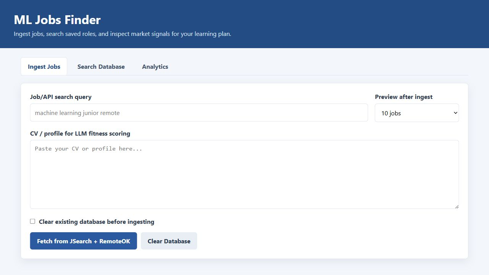
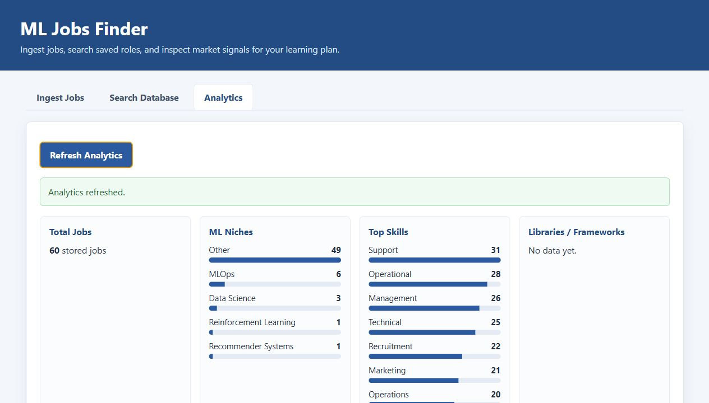
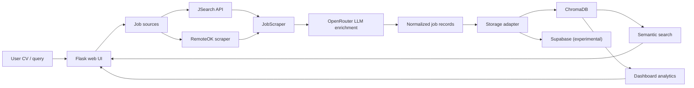

# ML Jobs Finder

This project is a small job-search assistant for machine-learning roles. It collects job postings from external sources, enriches them with an LLM using a CV/profile as context, stores the results in a vector database, and lets the user search or inspect the collected jobs through a simple web UI.

The goal is not only to find job ads, but to understand which roles fit a given profile and what skills appear repeatedly in the market.

## Screenshots

### Job Ingestion



### Analytics View



## Current Features

- Fetch jobs from JSearch through RapidAPI.
- Scrape RemoteOK jobs with Selenium.
- Enrich scraped jobs with OpenRouter-compatible LLM models.
- Score each job against a pasted CV/profile using a `job_fitness` value from 1 to 10.
- Store jobs in ChromaDB locally.
- Experimental Supabase storage adapter and SQL setup script.
- Search saved jobs semantically from the vector database.
- Sort search results by LLM fitness score.
- Show basic analytics:
  - total stored jobs
  - sources
  - experience distribution
  - ML niches
  - top skills
  - libraries/frameworks

## Architecture



## Repository Structure

```text
.
|-- app_web.py                 # Flask web application
|-- main.py                    # CLI/script entry point
|-- scraper.py                 # JSearch + RemoteOK scraping and LLM enrichment
|-- chroma_db.py               # Local ChromaDB wrapper
|-- utilities.py               # Formatting, sorting, reports, helper functions
|-- service/
|   |-- job_service.py         # Job normalization and ingestion service
|   |-- storage_adapter.py     # Chroma/Supabase adapter layer
|   `-- analytics_service.py   # Market statistics helpers
|-- templates/search.html      # Web UI
|-- tests/test_core.py         # Lightweight behavior tests
|-- supabase_setup.sql         # Experimental Supabase schema
`-- docs/images/               # README screenshots
```

## Setup

Create and activate a virtual environment:

```powershell
python -m venv .venv
.\.venv\Scripts\activate
pip install -r requirements.txt
```

Create a local `config.yaml` from the example:

```powershell
Copy-Item config.example.yaml config.yaml
```

Then fill in the values you need:

```yaml
api:
  openrouter_key: ""
  openrouter_url: "https://openrouter.ai/api/v1"
  rapidapi_key: ""
  rapidapi_host: "jsearch.p.rapidapi.com"

storage:
  adapter: "chroma"
  chroma_path: "chroma_db/"
```

Do not commit `config.yaml`; it contains local paths and API keys.

## Running the Web App

```powershell
.\run_web.ps1
```

By default this starts the app on:

```text
http://127.0.0.1:5001/
```

You can also run directly:

```powershell
$env:WEB_PORT = "5001"
.\.venv\Scripts\python.exe app_web.py
```

## Running the CLI Script

```powershell
.\.venv\Scripts\python.exe main.py
```

The script asks for a job search query and whether the existing Chroma collection should be cleared.

## How It Works

1. The user enters a job/API query and a CV/profile.
2. The app fetches jobs from JSearch and RemoteOK.
3. Each job is normalized into a shared schema.
4. If OpenRouter is configured, the LLM condenses the description and estimates:
   - seniority
   - required experience
   - skills
   - salary if available
   - `job_fitness`
   - a short comment explaining the fit
5. Jobs are stored in ChromaDB with sentence-transformer embeddings.
6. The search view retrieves similar jobs and sorts them by fitness score.
7. The analytics view summarizes the stored dataset.

## Tests

Run the lightweight test suite:

```powershell
.\.venv\Scripts\python.exe -m unittest discover -s tests
```

Current tests cover normalization, Chroma result extraction, vector IDs, tag splitting, analytics helpers, and fitness sorting.

## Notes and Limitations

- ChromaDB should be accessed by one running Python process at a time on Windows. Running the Flask app and `main.py` against the same `chroma_db/` folder can lock files.
- RemoteOK scraping depends on page structure and Selenium/ChromeDriver compatibility.
- `webdriver-manager` is used to select a ChromeDriver matching the installed Chrome version.
- OpenRouter enrichment is optional, but without it jobs keep default fields such as `job_fitness: N/A`.
- Supabase support is present as an adapter and SQL schema, but the local Chroma path is currently the most tested workflow.
- This is a learning/research project, not a production job board crawler.

## Roadmap Ideas

- Improve RemoteOK ingestion with a direct API/HTTP fallback.
- Add richer analytics charts.
- Add a chat/search view for questions like "Which jobs mention time series?".
- Harden Supabase storage and row-level-security policies.
- Add AWS deployment later.
- Add deduplicated scheduled ingestion.

## Acknowledgments

This project was built as an experimental personal tool for learning about RAG-style workflows, vector search, job-market analysis, and LLM-assisted software development.
